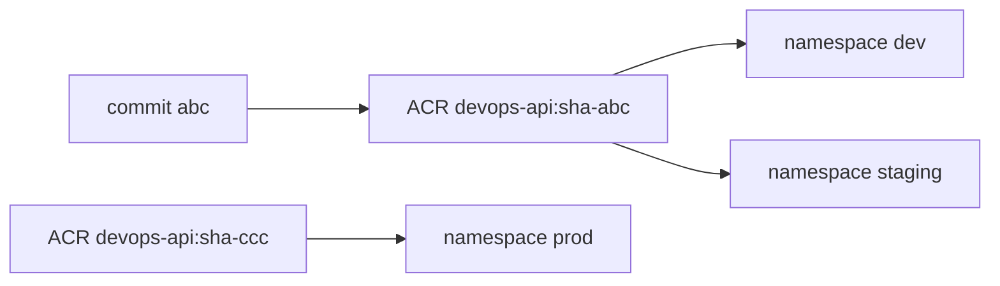
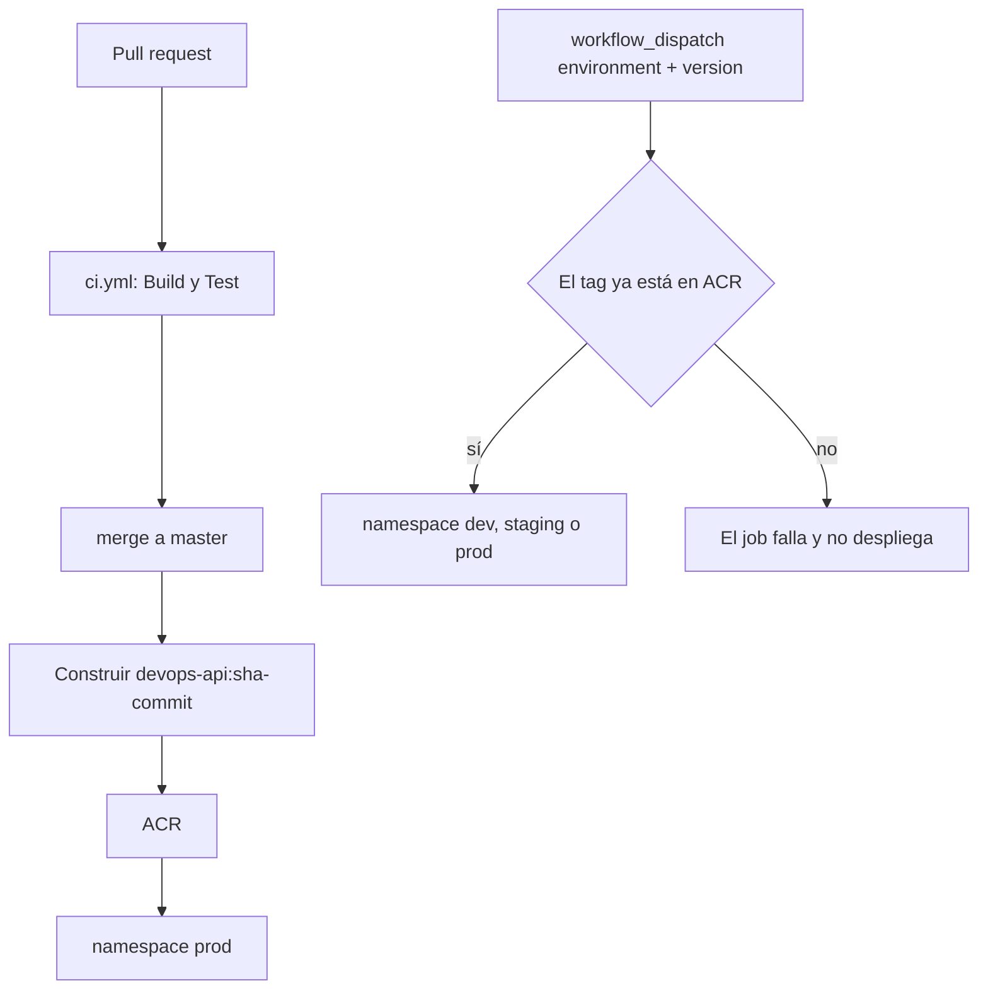
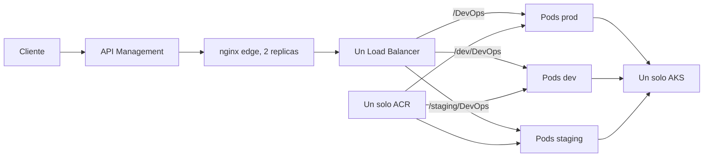

# DevOps challenge

## Cómo evaluar

HOST de producción: `apim-devops-btezn.azure-api.net`

URL: `https://apim-devops-btezn.azure-api.net/DevOps`

En bash, con el secreto recibido por canal privado:

```bash
export JWT_SECRET="<secreto-entregado-en-privado>"
JWT=$(python3 scripts/generate_jwt.py)
curl -X POST \
  -H "X-Parse-REST-API-Key: 2f5ae96c-b558-4c7b-a590-a501ae1c3f6c" \
  -H "X-JWT-KWY: ${JWT}" \
  -H "Content-Type: application/json" \
  -d '{ "message": "This is a test", "to": "Juan Perez", "from": "Rita Asturia", "timeToLifeSec": 45 }' \
  https://apim-devops-btezn.azure-api.net/DevOps
```

En PowerShell el JSON no debe ir partido. Este comando ya fue probado:

```powershell
$env:JWT_SECRET = "<secreto-entregado-en-privado>"
$env:JWT = (python .\scripts\generate_jwt.py).Trim()
Invoke-RestMethod -Method POST -Uri "https://apim-devops-btezn.azure-api.net/DevOps" -Headers @{
  "X-Parse-REST-API-Key" = "2f5ae96c-b558-4c7b-a590-a501ae1c3f6c"
  "X-JWT-KWY" = $env:JWT
} -ContentType "application/json" -Body '{"message":"This is a test","to":"Juan Perez","from":"Rita Asturia","timeToLifeSec":45}'
```

Respuesta esperada, HTTP 200:

```json
{"message": "Hello Juan Perez your message will be sent"}
```

Prueba negativa: `GET https://apim-devops-btezn.azure-api.net/DevOps` devuelve el cuerpo `ERROR`.

Cada ejecución de `scripts/generate_jwt.py` emite un JWT nuevo (`jti` distinto). El token dura 15 minutos y puede reutilizarse mientras siga vigente. No hay prevención de replay. Esa protección queda descrita como mejora en la sección de presupuesto.

## Levantar en otra suscripción

No hay tenant, suscripción, IP ni nombres de Azure escritos en el código. Un entorno nuevo solo cambia `infra/terraform.tfvars` y los secretos que el script copia a GitHub.

1. Entra en la suscripción destino con `az login` y en el repositorio con `gh auth login`.
2. Copia `infra/terraform.tfvars.example` a `infra/terraform.tfvars`.
3. Rellena suscripción, tenant, correo de alertas y `jwt_secret`. Los identificadores de GitHub salen de `gh api user` y `gh repo view --json databaseId`.
4. `terraform -chdir=infra init` y `terraform -chdir=infra apply`. En una suscripción vacía esto crea también la identidad de GitHub. Si esa aplicación ya existe, impórtala al estado antes de aplicar.
5. Exporta `API_KEY` y `JWT_SECRET`, y ejecuta `bash scripts/configure_github.sh`.
6. Haz push a `master`. El pipeline construye la imagen, la despliega y apunta API Management a la IP que Azure acabe de asignar al balanceador.

Para destruirlo: `terraform -chdir=infra destroy`.

## Arquitectura

El cliente entra por un solo API Management. El gateway valida la API Key y el JWT solo en el POST y reenvía los demás métodos al backend, que responde `ERROR`. Hay un AKS. Cada namespace tiene su Deployment y su Service. La aplicación vuelve a validar API Key y JWT.

El tamaño de nodo es la variable `vm_size`. El valor por defecto, `Standard_D2as_v4`, cabe en una suscripción con cuota de 4 vCPU. El pipeline descubre la IP del balanceador en cada despliegue y actualiza el backend de API Management. La escalabilidad de la aplicación es el HPA de producción, de 2 a 4 Pods.

## Local

```powershell
python -m venv .venv
.\.venv\Scripts\pip.exe install -e ".[dev]"
$env:API_KEY = "2f5ae96c-b558-4c7b-a590-a501ae1c3f6c"
$env:JWT_SECRET = "cambia-este-secreto-de-al-menos-32-bytes"
.\.venv\Scripts\pytest.exe --cov=app --cov-branch --cov-fail-under=90
docker build -t devops-api:local .
docker run --rm -p 8080:8080 -e API_KEY -e JWT_SECRET devops-api:local
```

## Ambientes

Un solo AKS, un solo ACR y un solo API Management. Los ambientes son namespaces.

| Ambiente | Cómo se despliega | URL |
| --- | --- | --- |
| prod | Push a `master` | `https://apim-devops-btezn.azure-api.net/DevOps` |
| dev | Actions, Run workflow, environment `dev`, version `sha-<commit>` | `https://apim-devops-btezn.azure-api.net/dev/DevOps` |
| staging | Igual, con environment `staging` | `https://apim-devops-btezn.azure-api.net/staging/DevOps` |

Cada namespace corre la versión que se le indicó. Producción tiene HPA de 2 a 4 Pods. Dev y staging quedan en 1 réplica. La suscripción admite solo 3 IP públicas en la región, así que hay un solo Service `LoadBalancer` compartido. API Management elige el namespace por la ruta: `/DevOps`, `/dev/DevOps` o `/staging/DevOps`.

## Versionamiento

Cada imagen es inmutable. El pipeline no despliega `latest`.

| Etiqueta | Cuándo aparece |
| --- | --- |
| `sha-<commit>` | En cada push a `master`. Es la versión que queda en producción. |
| `vX.Y.Z` | Si esa etiqueta ya existe en ACR. El despliegue manual la acepta igual que un `sha-`. |

La versión que corre un ambiente es el tag con el que se desplegó ese namespace. Los tres pueden ser distintos al mismo tiempo.



## Pipelines

`ci.yml` corre en cada push y en cada pull request. Tiene dos jobs: `Build` y `Test`.

`cd.yml` tiene dos caminos.



El push a `master` solo actualiza producción. No toca dev ni staging.

## Promover una versión sin mover las demás

Ejemplo: producción corre `sha-ccc` porque ese fue el último merge a `master`. Staging está probando `sha-bbb`. En dev ya validaste `sha-aaa` y quieres pasarla a staging.

En GitHub: Actions, workflow `cd`, Run workflow.

- Environment: `staging`
- Version: `sha-aaa`

Eso redespliega solo el namespace `staging` con la imagen que ya está en dev. Producción sigue en `sha-ccc`. Dev sigue en `sha-aaa`.

Para llevar esa misma versión a producción sin construir otra imagen, el mismo formulario con Environment `prod` y Version `sha-aaa`. El siguiente push a `master` volverá a desplegar el `sha-` de ese commit nuevo. Rollback es el mismo formulario con un tag anterior.

## Arquitectura de despliegue



## CI/CD

- `ci.yml`: jobs `Build` y `Test` en cada push y pull request.
- `cd.yml`: push a `master` construye `sha-<commit>` y despliega en `prod`. `workflow_dispatch` redespliega un tag existente en `dev`, `staging` o `prod`.
- El apply de Terraform es local y bajo demanda. El workflow de infraestructura solo hace plan, para no crear una segunda copia del clúster.

## Costo

Estimación de lista East US, 2 de octubre de 2026, para dos `Standard_D2as_v4` (USD 0,096/h cada una), un Load Balancer, una IP, dos discos de 64 GiB y ACR Basic: unos USD 0,24 por hora, USD 6 por 24 h, USD 12 por 48 h y USD 17 por 72 h. API Management Consumption no tiene cargo fijo. El budget de USD 30 avisa al 50, 80 y 100 % del costo real y al 100 % pronosticado. No apaga recursos. Hay que ejecutar `terraform destroy` al cerrar la evaluación.

## Mejoras con más presupuesto

Un JWT de un solo uso no está implementado. Cada token nuevo lleva un `jti` distinto, pero un token vigente puede repetirse. Rechazar la repetición exige un almacén compartido entre los Pods: la memoria de cada réplica no sirve, porque el otro Pod no vería el `jti` ya consumido. Ese almacén, por ejemplo Redis, suma costo fijo y no cabe en el presupuesto de USD 30 de esta prueba. Con más presupuesto se puede añadir y consultar el `jti` antes de aceptar el POST.

## Limitaciones

- El tramo API Management hacia el balanceador es HTTP. El balanceador es público; la aplicación vuelve a exigir API Key y JWT.
- Los probes solo comprueban que el puerto 8080 acepte TCP.
- El secreto JWT no está en el repositorio.
